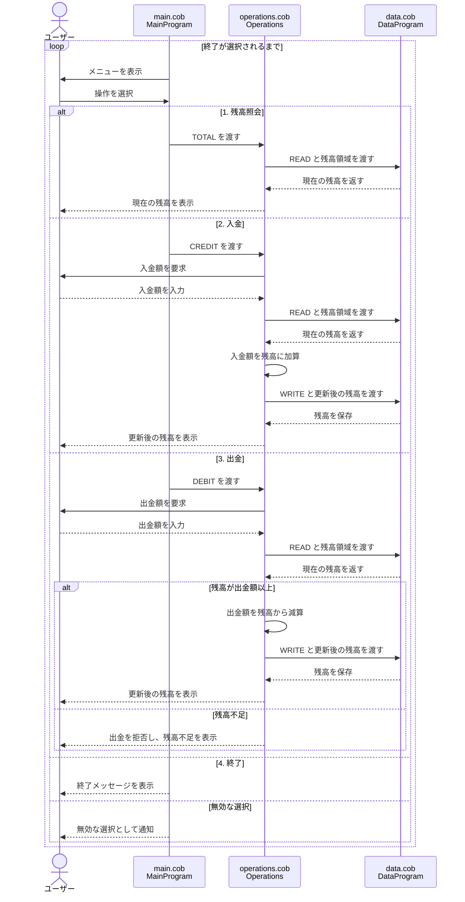

# 学生アカウント管理プログラム

このディレクトリでは、学生アカウントの残高を管理する COBOL プログラムの構成と業務ルールを説明します。

## COBOL ファイルの役割

### `src/cobol/main.cob`

`MainProgram` は、ユーザーとの対話とメインメニューを担当します。

- 残高照会、入金、出金、終了のメニューを表示する
- ユーザーの選択を受け付ける
- 選択に応じて `Operations` を呼び出す
- 1 から 4 以外の入力にはエラーメッセージを表示する
- 終了が選択されるまで処理を繰り返す

### `src/cobol/operations.cob`

`Operations` は、学生アカウントに対する残高操作を担当します。`main.cob` から受け取った操作種別に応じて、`DataProgram` から残高を読み書きします。

- `TOTAL `: 現在の残高を表示する
- `CREDIT`: 入金額を受け取り、残高に加算する
- `DEBIT `: 出金額を受け取り、残高から減算する
- 出金後の残高が負になる場合は、出金せず「残高不足」と表示する

### `src/cobol/data.cob`

`DataProgram` は、アカウント残高を保持するデータアクセス用プログラムです。

- `READ` 操作で保持している残高を呼び出し元へ返す
- `WRITE` 操作で呼び出し元から受け取った残高を保存する
- 残高の初期値は `1000.00` である

## 学生アカウントの業務ルール

- アカウントは `1000.00` の残高で開始する。
- 残高照会では、現在の残高を変更せずに表示する。
- 入金では、入力された金額を現在の残高に加算して保存する。
- 出金は、出金額が現在の残高以下の場合だけ実行する。
- 残高を超える出金は拒否し、残高は変更しない。
- 金額は COBOL の `PIC 9(6)V99` で扱われ、整数部 6 桁・小数部 2 桁の形式である。
- 現在の実装には、入金額・出金額が正数かどうかを検証する処理はない。
- 現在の実装には、ファイルやデータベースへ残高を書き出す永続化処理はない。残高はプログラム実行中に `DataProgram` の作業領域で保持される。

## 操作の流れ

1. `main.cob` がメニューを表示する。
2. ユーザーが操作を選択する。
3. `main.cob` が操作種別を `operations.cob` に渡す。
4. `operations.cob` が必要に応じて `data.cob` から残高を読み取り、更新後の残高を書き戻す。
5. 処理結果を画面に表示する。

## データフローのシーケンス図

